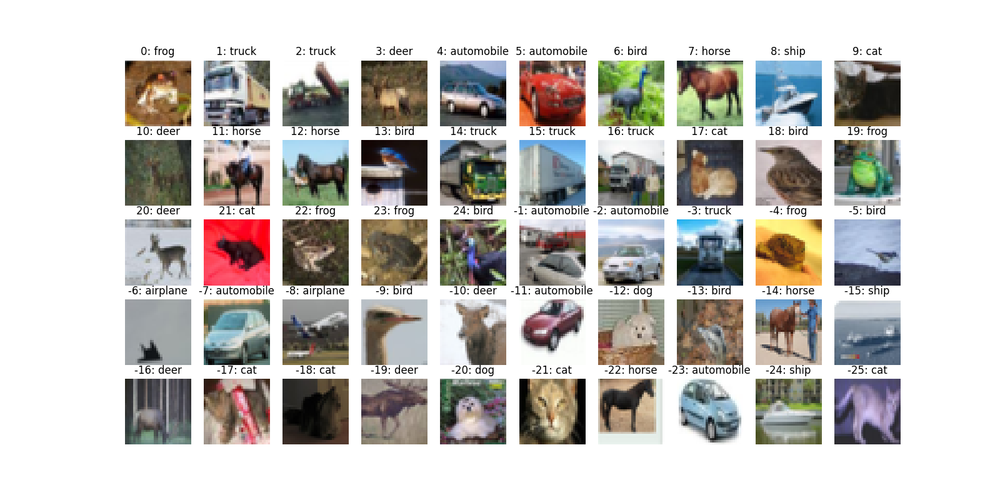

# A brief intro to PyCmpltrtok

[PyCmpltrtok](https://github.com/cmpltrtok20/PyCmpltrtok) is a collection of the common python3 codes used in [Cmpltrtok](https://github.com/cmpltrtok20)'s projects, such as:

* [TVTS (Trackable and Visible Training System)](https://github.com/cmpltrtok20/tvts)
* The author's other python3 projects that are under development.

Currently, **only Linux platforms** are considered. Maybe the user could run it on other Unix-like platforms, but it is not tested.

# Clone the code

```bash
$ mkdir PyCmpltrtok
$ git clone https://github.com/cmpltrtok20/PyCmpltrtok.git PyCmpltrtok
```

# Organization of the code

```
PyCmpltrtok
├── common_np.py (Common code for numpy.)
├── common_opencv.py (Common code for opencv.)
├── common.py (Normal Common code collection.)
├── data (To provide some data.)
│   └── cifar10 (To provide cifar10 data.)
│       ├── _data (This directory's content is generated by the script at the first time to invoke
│       │       load_cifar10.py, so the user at least should have the privilege to create it and write
│       │       files into it when the user run the load_cifar10.py for the 1st time.)
│       │   ├── cifar-10-batches-py (The code will decompress cifar-10-python.tar.gz to here.)
│       │   │   ├── batches.meta
│       │   │   ├── data_batch_1
│       │   │   ├── data_batch_2
│       │   │   ├── data_batch_3
│       │   │   ├── data_batch_4
│       │   │   ├── data_batch_5
│       │   │   ├── readme.html
│       │   │   └── test_batch
│       │   └── cifar-10-python.tar.gz (The code will download this file here when it runs at 
│       │           the first time. Or the user could just copy it here if she already has one.)
│       ├── load_cifar10.py (The script to download, decompress, and return training and 
│       │       validating data of cifar10.)
```

Note: 

 - data/cifar10/\_data/

This directory and its content are generated by the script the first time to invoke data/cifar10/load\_cifar10.py, so the user at least should have privildge to create it and write files into it when the user firstly run the load_cifar10.py script.

 - data/cifar10/_data/cifar-10-python.tar.gz

The code will download this file at here when it runs at the first time. Or the user could just copy it to here if she already has one, especially when it will be very slow to download with a bad Internet connection.

# Use the code

They are just normal python3 codes.

For instance, the user could use them as below:

**Make sure /python/project/root/dir is in the environment variable PYTHONPATH.**

```bash
$ cd /python/project/root/dir
$ ln -s /path/to/where/PyCmpltrtok/is/cloned PyCmpltrtok
```

Then use them in the user's python3 project as below: ( Here the author just demonstrates how to load the cifar10 data. )

```python
from PyCmpltrtok.common import *
from PyCmpltrtok.common_np import *
from PyCmpltrtok.common_opencv import *
import PyCmpltrtok.data.cifar10.load_cifar10 as cifar10

x_train, y_train, x_test, y_test, label_names = cifar10.load()
shape_ = cifar10.shape_  # The shape of very image, it is (3, 32, 32), i.e. (C, H, W).
x_train = x_train.reshape(-1, *shape_)
x_test = x_test.reshape(-1, *shape_)
x_train = uint8_to_flt_by_lut(x_train)
x_test = uint8_to_flt_by_lut(x_test)
```

## Use the cifar10 data

The user could use the above invocation to use the Cifar10 data. It will download cifar-10-python.tar.gz if it is not at there.

The user could also invoke PyCmpltrtok/data/cifar10/load_cifar10.py to download and check the data.

The user will see the information below if the entire tar file is downloaded and decompressed normally. In the last 2 steps of this script, it will try to visualize the data by matplotlib. So please run it in a GUI terminal or set up the environment variable DISPLAY and an X11 server to get the visualization result.

```txt
--------------------------------Label names--------------------------------
0 airplane
1 automobile
2 bird
3 cat
4 deer
5 dog
6 frog
7 horse
8 ship
9 truck
--------------------------------Data loaded--------------------------------
x_train <class 'numpy.ndarray'> (50000, 3072) uint8
x_test <class 'numpy.ndarray'> (10000, 3072) uint8
y_train <class 'numpy.ndarray'> (50000,) uint8
y_test <class 'numpy.ndarray'> (10000,) uint8
--------------------------------Check data--------------------------------
Checking x_train and y_train ...
Check and close the plotting window to continue ...
Checking x_test and y_test ...
Check and close the plotting window to continue ...
Over! Data loaded and checked!
--------------------------------All over--------------------------------
```

The visualization result will be like below. They are the first 25 and last 25 images with their category labels.



# About the author

Hi, my name is [**Yunpeng Pei**](https://github.com/cmpltrtok20), an AI engineer working in the City of Beijing, China. I developed [these projects](https://github.com/cmpltrtok20?tab=repositories) in my spare time just for interest. I will be very happy if you find them to be very little help to the community. I must say sorry that they are far away from perfect and their document is not finished yet, because of my limited ability and limited resources on these projects; although I have tried my best. You could contact me freely by email to my personal email **belarc@163.com**.

